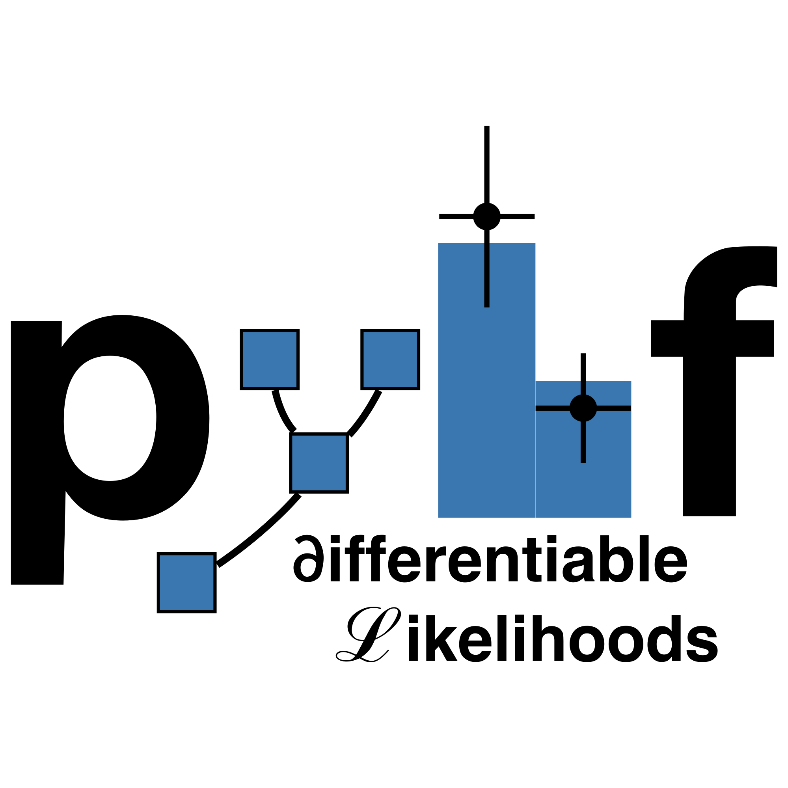

# pyhf's application to NumFOCUS for Affiliated Project status

1. Does your project have a contributor Code of Conduct?

Yes

2. What is the name of your project?

pyhf

3. Please provide the url of your project's (primary) repo

https://github.com/scikit-hep/pyhf

4. Your project's website (if applicable)

https://pyhf.readthedocs.io/

5. Please provide a summary description of your project in a few sentences.

pyhf is a pure-Python library for the building and serialization of statistical models used commonly in high energy physics.
It also supports statistical inference powered by n-dimensional array library computational backends, including machine learning libraries that allow for exploitation of automatic differentiation and hardware acceleration for speeding up model fitting.

6. Does your project have a logo?

Yes

7. Please upload a .svg file of your project's logo. A "square" format is best.

8. Your project's Twitter handle or other social media handles/urls:

`@pyhf_`

9. Why do you want your project to join NumFOCUS?This question is required.

The maintainers of pyhf care about creating sustainable open source software for particle physics, as well as the broader scientific community, and contributing to communities with similar goals.
The community of projects that NumFOCUS has created is exactly the kind of organization the pyhf team wants to partner with.
We look forward to engaging with and learning from the mentorship the NumFOCUS community can provide and we are excited to contribute our skills and experience to the rest of the community.

10. Are you applying for Fiscal Sponsorship or Affiliation?

affiliation

11. How does your project relate to or integrate with the existing ecosystem of NumFOCUS tools?

pyhf uses NumPy and SciPy as core dependencies and uses Matplotlib as an optional dependency for visualization.
It builds upon these libraries to provide statistical modeling for a common family of binned probability models in particle physics.

12. Describe how your project furthers the NumFOCUS mission:
https://numfocus.org/community/mission

pyhf is part of the Scikit-HEP project which is a community-driven and community-oriented project with the aim of providing Particle Physics at large with an ecosystem for data analysis in Python.
As part of this effort, pyhf empowers particle physics analysts across experiment and theory with expressive models and performant statistical inference while promoting an open ecosystem of tools.
Additionally, pyhf's JSON model serialization format has been adopted to openly publish the first full probability models from experiments at the CERN Large Hardon Collider, allowing for theorists and experimentalists to have a fully open shared representation of the model used for final analysis.
This has promoted closer collaboration between theorists and experimentalists.

13. How many active contributors does your project currently have?

4

14. Any comments you’d like to make on the number of your active contributors:

There are three core developers and one contributor (the core developer of a library that builds on top of pyhf) who will periodically contribute code.
However, there are are additional users who engage with the project through GitHub Issues and Discussions that do not necessarily contribute code back to the project on a regular basis.

15. What is your project doing to attract and/or mentor new contributors and maintainers?

Maintaining pyhf requires experience with statistical methods used in experimental particle physics.
The pyhf dev team is currently working with large experimental collaborations that are interested in adopting pyhf to raise awareness of development needs and to communicate the importance of having maintainers from across different subdomains of particle physics.
One member of the pyhf dev team is supported by NSF cooperative agreement OAC-1836650 to work on the project.
The team expects that there will be a new NSF cooperative agreement in 2023 that could support a portion of time for an additional maintainer.

16. Where do you host conversations about project development and governance (e.g. mailing lists, forums, etc.), and how many participants do you have?

The project GitHub Discussions (https://github.com/scikit-hep/pyhf/discussions).
There is also an announcements mailing list through Google Groups (https://groups.google.com/group/pyhf-announcements/subscribe), but we ask that people give feedback and comments through GitHub Discussions.

The participants are usually other maintainers of Scikit-HEP packages and power users that have a vested interest in the project development.
There are usually between three and six participants in these discussions.
There are sometimes private (based on data that can not yet be made public) discussions that experimental collaborations in particle physics will have with the core developers, but the dev team works to make revised or redacted versions of the information in these discussions appear in the public GitHub Discussions or in Issues.

17. What license(s) does your project currently use?

Apache License, Version 2.0

18. Projects must adopt the NumFOCUS Code of Conduct or one similar in spirit. Please tell us how you plan to meet this requirement:
https://numfocus.org/code-of-conduct

We will adopt the NumFOCUS Code of Conduct and extend it to include our existing Code of Conduct "Responsibilities" and "Scope" sections which come from the Contributor Covenant v1.4 (http://contributor-covenant.org/version/1/4).

19. Your Name (First & Last):

Matthew Feickert

20. Your Email:

matthew dot feickert @ no-spam-please dot cern dot ch

21. Questions or Comments:
